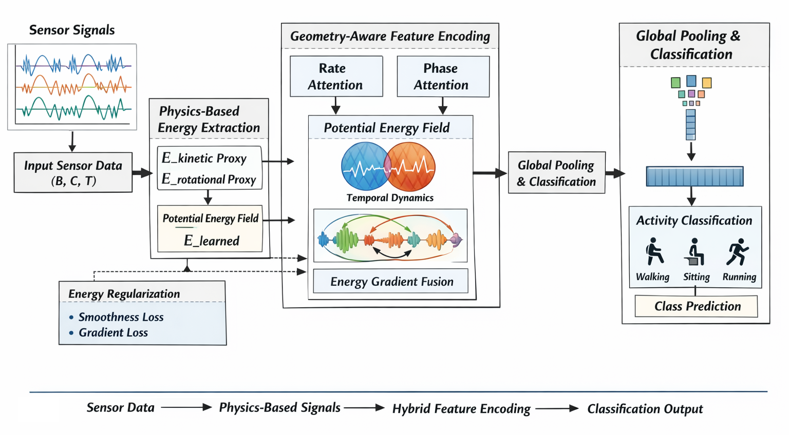

# Physics-Derived Rate and Phase Decomposition with Attention-to-Attention Reconciliation for Robust Inertial Activity Recognition


<p align="center"></p>

This repository implements the methodology proposed in the paper "Physics-Derived Rate and Phase Decomposition with Attention-to-Attention Reconciliation for Robust Inertial Activity Recognition".


## Paper Overview
**Abstract**: Current deep-learning human activity recognition
(HAR) models typically fuse physics-derived signals in a static
manner, which can undermine robustness: first-order motion
dynamics (rate/power) and second-order structural transitions
(phase/jerk) encode complementary, different-order information
and are degraded asymmetrically under real-world sensor distortions.
To address this, we present an Energy-Inspired Landscape
Modeling framework augmented with an Attention-to-
Attention (A2) reconciliation mechanism. Our method injects
energy-based inductive biases—drawing on kinetic and potential
energy concepts—to regularize the latent geometry of inertial
signals and to produce complementary Rate and Phase feature
views. The A2 module explicitly separates first- and second-order
energy derivatives into Power and Jerk proxies and performs
context-conditioned reconciliation: it infers per-cue reliability
from the joint consideration of attention scores and feature
magnitudes (rather than predicting a separate confidence head)
and dynamically calibrates each view’s contribution. Extensive
experiments on five public benchmarks (UCI-HAR, WISDM, MotionSense,
MHEALTH, and PAMAP2) demonstrate a favorable
accuracy–efficiency trade-off (peak F1 = 0.9974 on MotionSense),
substantially improved stability under sensor perturbations, and
practical on-device efficiency (≈ 0.07M parameters; avg. latency
≈ 3.1 ms on a desktop CPU; 18.88 ms on Raspberry Pi 4B).

## Dataset
- **UCI-HAR** dataset is available at _https://archive.ics.uci.edu/dataset/240/human+activity+recognition+using+smartphones_
- **PAMAP2** dataset is available at _https://archive.ics.uci.edu/dataset/231/pamap2+physical+activity+monitoring_
- **MHEALTH** dataset is available at _https://archive.ics.uci.edu/dataset/319/mhealth+dataset_
- **WISDM** dataset is available at _https://www.cis.fordham.edu/wisdm/dataset.php_
- **MotionSense** dataset is available at _https://github.com/mmalekzadeh/motion-sense?tab=readme-ov-file_

## Requirements
```
torch==2.5.0+cu126
numpy==2.0.2
pandas==2.2.2
scikit-learn==1.6.1
matplotlib==3.10.0
seaborn==0.13.2
fvcore==0.1.5.post20221221
```
To install all required packages:
```
pip install -r requirements.txt
```

## Codebase Overview
- `model.py` - Implementation of the proposed **Energy-Inspired Landscape Modeling** framework.
The implementation uses PyTorch, Numpy, pandas, scikit-learn, matplotlib, seaborn, and fvcore (for FLOPs analysis).

## Citing this Repository

If you use this code in your research, please cite:

```
@article{Physics-Derived Rate and Phase Decomposition with Attention-to-Attention Reconciliation for Robust Inertial Activity Recognition},
  title = {Physics-Derived Rate and Phase Decomposition with Attention-to-Attention Reconciliation for Robust Inertial Activity Recognition},
  author={JunYoung Park and Myung-Kyu Yi}
  journal={},
  volume={},
  Issue={},
  pages={},
  year={}
  publisher={}
}
```

## Contact

For questions or issues, please contact:
- JunYoung Park : park91802@gmail.com

## License

This project is licensed under the MIT License - see the [LICENSE](LICENSE) file for details.
